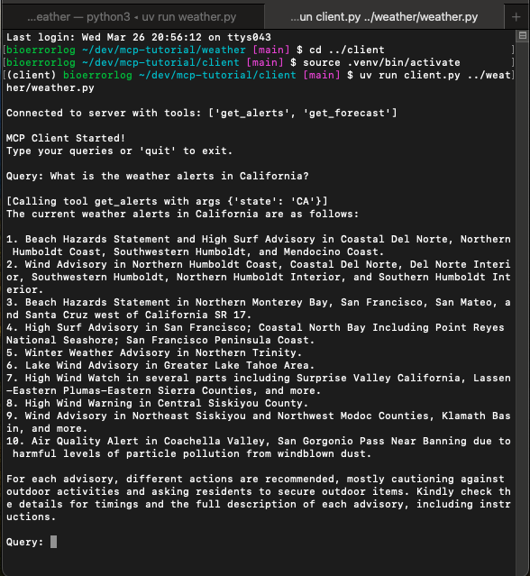

# MCP Quickstart for OpenAI API / GPT

This is the OpenAI API / GPT implementation for the [official MCP (Model Context Protocol) Quickstart](https://modelcontextprotocol.io/introduction).



## 🚀 Slack MCP Quickstart

FastAPI で動かす **Slack 通知用 MCP サーバー** の最小テンプレートです。  
Render や Heroku の無料ティアに1クリックでデプロイできます。

### 🏗️ 構成

[](https://render.com/deploy?repo=mcp-gpt-tutorial)

[](https://heroku.com/deploy?template=mcp-gpt-tutorial)

## 🚀 初回テスト方法

以下のコマンドで、初回テストを行うことができます。

```bash
curl -X GET http://localhost:8000/health
